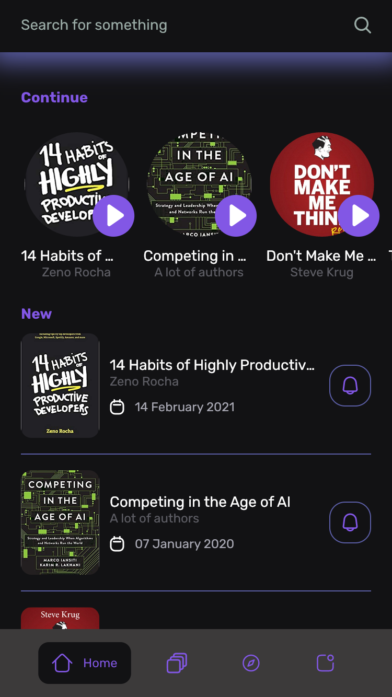
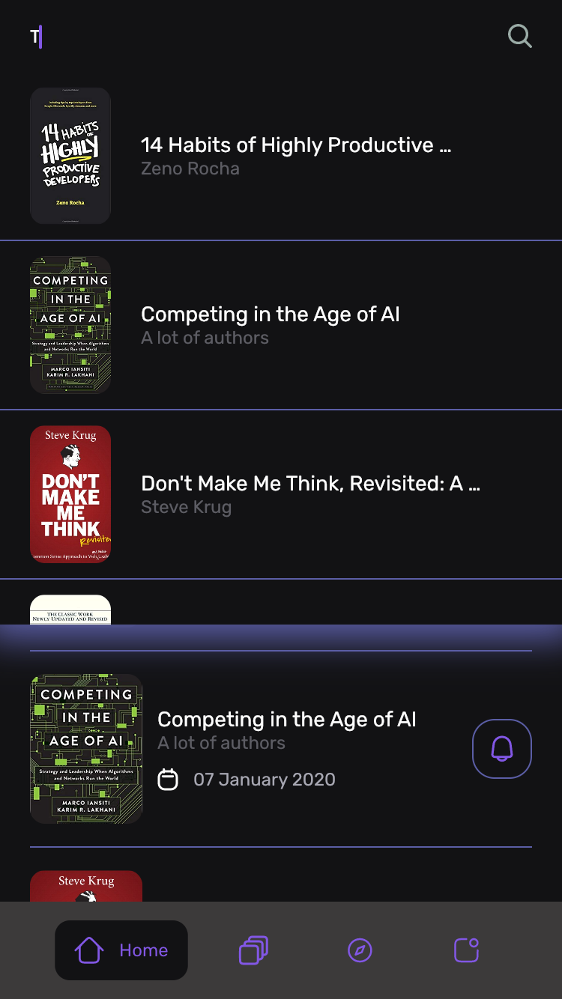
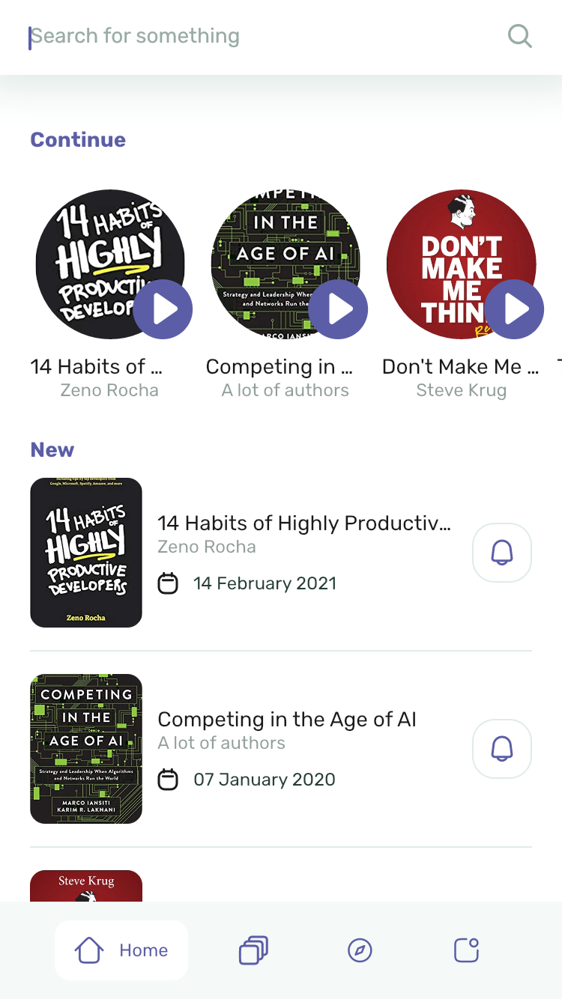
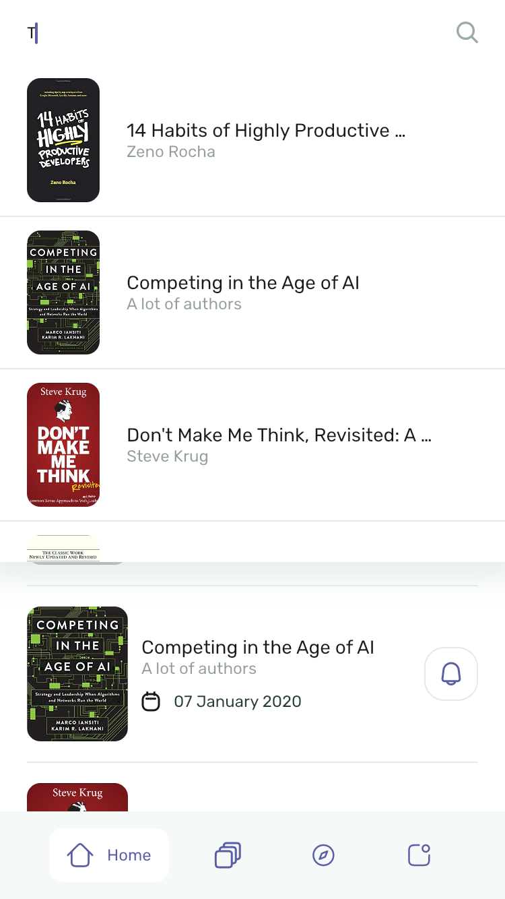
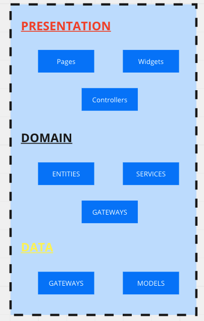

# Books

<p align="center">
  
  
</p>

<p align="center">
  
  
</p>

The Books is a programming-oriented application written in Flutter meant to list some books.

> This application is built only for iOS and Android platforms. Even though the Flutter SDK has great support for all platforms including Linux, Windows, MacOS, and Web.

This README is designed to guide how this project is structured and some configurations.

  - [Setup](#setup)
  - [Architecture](#architecture)
  - [Tools](#tools)

## Setup

This project uses the Flutter SDK and Flutter Version Management tool(a.k.a FVM). If you do not have any idea how to install these tools you can check them out in the [Flutter - Get Started](https://docs.flutter.dev/get-started/install) and [FVM - Getting Started](https://fvm.app/docs/getting_started/overview). 

With these tools installed locally you can run the `fvm flutter pub get` command to fetch the dependencies.

## Architecture

Based on some concepts of Clean Architecture this architecture is designed to be simpler and don't overengineer, thus making things not slower and harder.

We have three main layers `data`, `domain` and `presentation`.



### Presentation

The entry point of all users with some app interactions. This layer has the responsibility for rendering widgets and state management.

### Domain

This layer contains the business rules for the application. Also, it provides data for the `presentation` layer and accesses the `data` layer.

### Data

Responsible for accessing external data like external database, local database, APIs, etc.

## Tools

There're some tools that the project uses and also it's good this knowledge to fully understand the project.

### Assets generation

We're able to generate the paths for the assets(resources like fonts, images, etc) with the [flutter_gen](https://pub.dev/packages/flutter_gen) package. Execute the command `flutter packages pub run build_runner build` command for generating the path for the files in `assets/` directory.


### Golden Tests

The [Alchesmit](https://pub.dev/packages/alchemist) package was installed for creating tests for the widget's appearance in an easier way using the `testGoldens()` for creating this kind of test.

You can start reading the [Testing the widget’s appearance in Flutter](https://medium.com/@leonardoorosaa16/testing-the-widgets-appearance-in-flutter-b0ba8b4c32ff) if you would like deep dive into the Golden Tests with *Alchesmit* in Flutter.

## Integration tests

Flutter's [integration_test](https://docs.flutter.dev/testing/integration-tests) does a great job but has some features we can't test using the standard API like some *native interactions*. The Books' project uses the [Patrol](https://patrol.leancode.co/getting-started) integration test tool providing an easy way for writing integration tests in Flutter Framework. 

You need to install the [patrol_cli](https://patrol.leancode.co/native/setup#install-patrol_cli) locally before starting with the *Integration Tests* in the Books project.

After installed the `patrol_cli` locally,  you may run the tests executing the `patrol test --target integration_test/integration_test.dart --verbose --no-label` command.

### Localizations

The Books' project uses the `flutter_localizations` from Flutter SDK for language internationalization. Use the `localization` global variable for accessing the internationalization like the example below:

```dart
class MyWidget extends StatelessWidget {
  const MyWidget({super.key});

  @override
  Widget build(BuildContext context) {
    return AppText.paragraph12(localizations.home)
  }
}
```

### Riverpod

In The Flutter environment, there are a lot of state management tools. But, the Books' project uses the [Riverpod](https://docs-v2.riverpod.dev/docs/introduction) because:

- simple and easy to use;
- good for deal with asynchronous;
- great community.

If you do not have any idea how to use the [Riverpod](https://docs-v2.riverpod.dev/docs/introduction) you can check the [Introduction](https://docs-v2.riverpod.dev/docs/introduction).